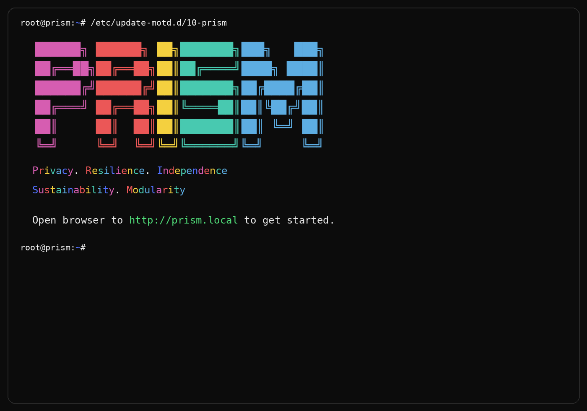

# PRISM

Own your server again.

**Download and build a better one. We dare you.**

*The PRISM identity banner — displayed on every login*

**P**rivacy · **R**esilience · **I**ndependence · **S**ustainability · **M**odularity

## What PRISM Is
PRISM is a private, resilient, independent home server platform for people who want local services without surrendering control. It is built on Debian, designed to stay root-accessible, and meant to explain itself instead of hiding behind appliance theater.

It starts with one box. That matters. PRISM is not built around the assumption that everyone needs a cluster, a rack, or an enterprise budget. The single-server experience is the product. If local AI or heavier workloads justify expansion later, PRISM can grow into that. If not, it should still stand on its own.

PRISM is also honest about hardware. It was born on recycled Dell OptiPlex systems because those machines are cheap, available, and still useful. That does not mean PRISM is trapped there. It works on recycled hardware, old gaming PCs, and brand new machines too. The rule is simple: start with what you have, then be honest about what that hardware can really do.

Its five values are explicit: privacy, resilience, independence, sustainability, and modularity. PRISM is supposed to protect your data, stay understandable under failure, keep you out of lock-in, extend the useful life of real hardware, and adapt honestly as your machine grows or changes.

## Meet Iris
Iris is the first face of PRISM.

She is not supposed to be a gatekeeper, a mascot, or a black box. She is the local guide who helps the owner understand what the machine is doing, what services are installed, where things live, and what tradeoffs matter.

PRISM should always expose three transparent ways to interact with the same system:
- Iris for guided explanation and setup
- Web GUI for visibility and daily management
- Terminal for full unrestricted control

### Iris Personalities

Iris has a personality system. At first boot the owner
chooses how Iris talks to them:

- Professional — clean and direct
- Friendly — warm and encouraging
- Playful — light and witty
- Zen — calm and minimal
- Technical — detailed and precise
- Custom — define your own

This can be changed anytime. "Hey Iris, switch to zen mode."

The personality system also supports community themes —
coordinated voice, response style, and UI accent colors
that anyone can build and share. Think desktop themes
from the Windows 95 era, but for your AI assistant.

If Iris is doing her job right, the owner ends up more informed, not more dependent.

## Two Ways To Run
### PRISM Offline
The heavier image.

It ships with the major pieces already present:
- Ollama installed
- local model already included
- nginx and Iris chat UI already staged
- larger image, faster to use once booted

This is the version for people who want a self-contained artifact and minimal download time after first boot.

On every first boot, after Iris is ready for the first time,
PRISM plays the Winamp llama clip exactly once.

It really whips the llama's ass.

This is not a joke about the software. It is a celebration
of the fact that the owner is running serious local AI on
their own hardware. It happens once. After that Iris
greets normally per personality.

### PRISM Net
The lighter image.

It starts smaller, boots faster onto hardware, and downloads what it needs on first boot while Iris guides the owner through setup in the browser.

This is the version for people who want:
- a smaller image
- hardware-aware setup
- only the services that actually make sense for the machine
- a first boot flow that stays recognizably PRISM instead of collapsing into a sterile installer

## Three Ways To Get It
### 1. Build It
Clone the repo, inspect everything, and build your own image.

This is the most PRISM way to do it.

### 2. Flash It
Download a published image, write it to disk, boot it, and let Iris take over from there.

### 3. Buy One Locally

PRISM is available prebuilt on recycled Dell OptiPlex hardware
in Eugene, Oregon.

- Plug it in
- Open a browser
- Meet Iris
- $100
- No subscription
- Ever

The hardware is recycled. The software is open source.
The data stays in your home.

If you are not in Eugene, the build instructions are right here.
Anyone can build one.

## What Runs On PRISM
### Core Services
- Vaultwarden for passwords and credential management
- AdGuard Home for DNS and ad blocking
- Nextcloud for files, sync, contacts, calendar, and photos
- Whoogle or SearXNG for private search
- Paperless-ngx for document archive and scanning destination
- Headscale for self-hosted private coordination
- nginx and fail2ban as part of the base platform

These are not random checkboxes. They form the PRISM identity:
- private daily-use tools
- personal infrastructure
- immediate value without cloud dependence

### Optional Services
- Jellyfin when extra storage exists
- Stable Diffusion when a usable GPU exists
- Gateway mode when a second NIC exists
- Home Assistant
- Gitea
- Calibre

PRISM should stay opinionated. A smaller, better-supported service list is better than a fake marketplace full of half-finished ideas.

## Built For Real Hardware
**PRISM's niche is giving new life to end-of-life computers that might otherwise end up in a landfill — but it works fantastic on brand new hardware too.**

That is not a marketing garnish. It is part of the product philosophy.

PRISM should be honest about hardware lifecycle, honest about performance, and honest about upgrade paths. A recycled OptiPlex is a real server if the software respects its limits. An old gaming PC is a great PRISM machine if it has the GPU and RAM to justify heavier local AI. A brand new machine is also fine. The point is not nostalgia. The point is useful private computing on hardware people actually have.

## Hardware Spectrum
### Minimum Viable
- Any x86 computer
- 8GB RAM
- Core privacy services
- Small local model
- Limited, but genuinely useful

### Sweet Spot
- 32GB RAM small-form-factor machine
- Recycled Dell OptiPlex
- Full core service stack
- Strong local assistant experience
- The hardware PRISM was born on

### Power User — The Retired Gaming PC

An old gaming PC is one of the best PRISM machines available.

Full-size tower means real GPU options. Existing PSU is already
sized for a GPU. CPU and RAM are usually decent. And when
someone upgrades to a new gaming PC, the old one is sitting
there doing nothing.

That machine can run a private AI assistant, a password manager,
private search, ad blocking, a media server, and local image
generation — all at the same time, for free, forever, without
sending data anywhere.

Recommended specs:
- 32GB to 64GB RAM
- GPU with 8GB+ VRAM (RTX 3060 or better recommended)
- Any modern-ish x86 CPU

Even a modest GPU dramatically changes the experience.
A GTX 1050 Ti with 4GB VRAM already showed 77% GPU
utilization and interactive response speeds on 3B models
in our testing. A better GPU does proportionally better.

### High End
- 64GB RAM or more
- Modern high-end GPU
- Full-speed local AI
- Best PRISM experience with the fewest compromises

## A Note On Clustering

Clustering works well for running PRISM services across
multiple machines. It does not work well for AI inference
on gigabit ethernet.

We tested this extensively. A single OptiPlex 7090 with
64GB RAM running llama.cpp outperformed a 7-node cluster
on distributed inference. A 12-node expanded cluster with
464GB combined RAM still could not run 405B usefully
on gigabit.

The network is always the bottleneck, not the RAM.

For AI inference: one good machine beats a cluster every time
on gigabit ethernet.
For running services: clustering works fine and distributes
load well.

See hippynurd/llm-on-recycling for the full honest benchmarks.

## Philosophy
PRISM should never become a black box.

The point is not to trap people inside a branded appliance. The point is to give them a polished private server that still feels like theirs.

Principles:
- No telemetry
- Full root access always
- Built on Debian
- Fully open source
- Local-first services
- Honest hardware expectations
- Explain the why, not just the what

The tone matters too:
- direct
- honest
- warm
- never corporate
- never sterile

The guiding line is still the right one:

> Leave people less ignorant, or at least entertained.

## Sustainability and Modularity

These are not afterthoughts. They are the S and M in PRISM.

### Sustainability
PRISM's niche is keeping working computers out of landfills.
Every PRISM running on end-of-life hardware is a computer
that did not become e-waste. Every private service running
locally is a workload that did not get sent to a data center
burning power somewhere else.

This is not nostalgia for old hardware. It is a practical
philosophy: if a computer can still do useful work, it should.
PRISM makes that work private, capable, and honest about
what the hardware can actually do.

### Modularity
PRISM starts with one box and grows with your hardware.

Nothing is locked in. Nothing requires buying into a platform.
Add a drive and Iris offers Jellyfin. Add a GPU and
Stable Diffusion becomes available. Add nodes and the
cluster option appears. Remove something and PRISM
adjusts honestly.

The owner always knows what is installed, why it is there,
and how to change it.

## Status

| Component | Status | Notes |
|---|---|---|
| PRISM Offline v0.1 | ✅ Complete | Built, compressed, boot tested in VM, Iris responding |
| PRISM Offline boot test VM | ✅ Complete | Iris responded via nginx, 157 seconds on recycled VM hardware |
| PRISM Offline boot test real hardware | ⏳ Pending | 7020 bare metal test not yet done |
| PRISM Net v0.1 | ✅ Complete | Built, verified, compressed (1GB) |
| PRISM Net boot test | ⏳ Pending | VM and real hardware test not yet done |
| Native service installers | ✅ Complete | All 6 core services written |
| GitHub publication | ✅ Live | https://github.com/hippynurd/prism |

## Author

Built by [hippynurd](https://github.com/hippynurd) in Eugene, Oregon.

30 years in IT infrastructure. Electronics manufacturing veteran
who assembled processor boards for the Thinking Machines CM-5 —
the first computer to break the teraflop barrier. Oregon Country
Fair IT infrastructure volunteer for 30 years. ISP operator.
Linux user since before it was easy.

PRISM came out of a simple frustration: privacy-focused home
servers exist, but none of them are honest about what they are,
what they cost, and what hardware they actually need.

This one tries to be.

If you build a better one, show your work.
That is how this is supposed to work.
